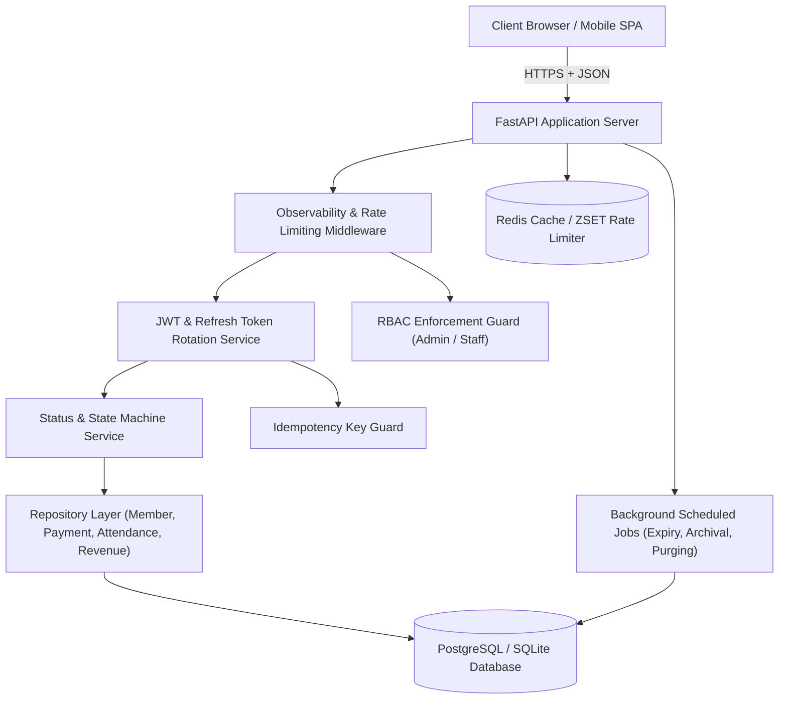
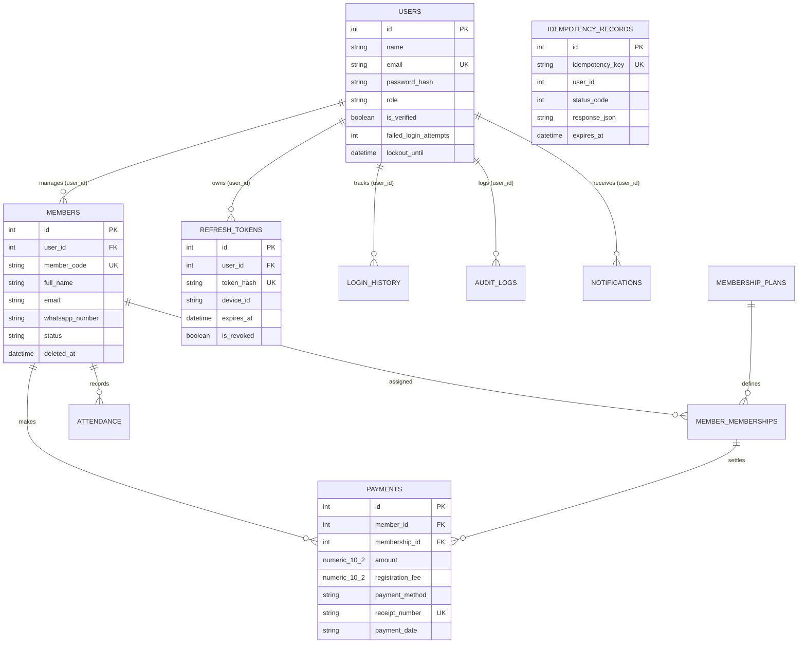

# 🏋️ STHX Technologies Gym Management Portal (v2.5 Production Hardened)

Enterprise-grade, multi-tenant Gym Management SaaS platform built with **FastAPI**, **SQLAlchemy**, **PostgreSQL / SQLite**, **Redis**, and a modern **Vanilla CSS Dark Blue Glassmorphism UI**. Fully production-hardened against race conditions, IDOR attacks, brute-force intrusions, and financial data corruption.

---

## 🏛️ System Architecture



---

## 🗄️ Database ERD (Entity Relationship Diagram)



---

## 🔧 Environment Variables Reference

Create a `.env` file in the root directory:

```ini
# Application Configuration
APP_NAME="STHX Technologies Gym Portal"
ENV="production"
DEBUG=false

# Security & Authentication
JWT_SECRET="sthxtechnologies_production_super_secret_jwt_key_2026_x89"
JWT_ALGORITHM="HS256"
ACCESS_TOKEN_EXPIRE_MINUTES=30
REFRESH_TOKEN_EXPIRE_DAYS=7

# Database Connection
DATABASE_URL="postgresql://<user>:<password>@<host>:<port>/<dbname>"


# Redis Cache & Rate Limiting
REDIS_URL="redis://localhost:6379/0"

# Brevo Email API Integration
BREVO_API_KEY="xkeysib-brevo-api-key-here"
EMAIL_FROM="support@sthxtechnologies.com"
EMAIL_FROM_NAME="STHX Technologies Support"

# CORS Configuration
ALLOWED_ORIGINS="https://gym.sthxtechnologies.com,http://localhost:8000"
```

---

## 🛡️ Security Documentation

1. **Authentication & Session Hardening**:
   - SHA-256 hashed refresh token rotation stored in `refresh_tokens`.
   - Single-device logout (`POST /api/auth/logout`) & all-device revocation (`POST /api/auth/logout-all`).
   - Password reset automatically invalidates all active device sessions.
2. **Account Lockout & Anti-Brute-Force**:
   - 5 consecutive failed login attempts trigger an automatic 15-minute account lockout (`lockout_until`).
   - Constant-time string comparison (`secrets.compare_digest`) for OTP verification to prevent timing side-channel attacks.
   - Anti-email enumeration responses for forgotten password requests.
3. **Idempotency Protection**:
   - Header `Idempotency-Key` or `X-Idempotency-Key` prevents duplicate member registrations, payments, and plan assignments.
   - Idempotency records expire and auto-purge after 24 hours.
4. **File Security**:
   - Magic bytes binary signature verification (JPEG, PNG, WEBP).
   - Executable extension rejection (`.php`, `.exe`, `.py`, `.js`, etc.), 5MB size limit, UUID filenames, and path traversal guards.
5. **IDOR & Multi-Tenant Scoping**:
   - All repository queries filter strictly by `user_id == current_user.id`.

---

## 🚀 Deployment Guide (Production Linux / Docker)

### System Requirements
- Ubuntu 22.04 LTS / Debian 12
- Python 3.11+
- PostgreSQL 15+
- Redis 7+
- Nginx & Systemd / Docker

### Step 1: System Package Installation
```bash
sudo apt update && sudo apt install -y python3-pip python3-venv postgresql postgresql-contrib redis-server nginx
```

### Step 2: PostgreSQL Setup
```sql
CREATE DATABASE sthx_gym_db;
CREATE USER sthx_user WITH PASSWORD '<YOUR_DB_PASSWORD>';
GRANT ALL PRIVILEGES ON DATABASE sthx_gym_db TO sthx_user;
```

### Step 3: Application Deployment
```bash
git clone https://github.com/TahaHussain2001/AI-Powered-Study-Notes-Generator.git /opt/sthx-gym
cd /opt/sthx-gym
python3 -m venv venv
source venv/bin/activate
pip install -r requirements.txt
cp .env.example .env
```

### Step 4: Systemd Service Setup (`/etc/systemd/system/sthx-gym.service`)
```ini
[Unit]
Description=STHX Technologies Gym Management Portal API
After=network.target postgresql.service redis.service

[Service]
User=www-data
WorkingDirectory=/opt/sthx-gym
ExecStart=/opt/sthx-gym/venv/bin/uvicorn main:app --host 127.0.0.1 --port 8000 --workers 4
Restart=always

[Install]
WantedBy=multi-user.target
```

```bash
sudo systemctl daemon-reload
sudo systemctl enable --now sthx-gym
```

### Step 5: Nginx Reverse Proxy Setup (`/etc/nginx/sites-available/sthx-gym`)
```nginx
server {
    listen 80;
    server_name gym.sthxtechnologies.com;

    client_max_body_size 5M;

    location / {
        proxy_pass http://127.0.0.1:8000;
        proxy_set_header Host $host;
        proxy_set_header X-Real-IP $remote_addr;
        proxy_set_header X-Forwarded-For $proxy_add_x_forwarded_for;
        proxy_set_header X-Forwarded-Proto $scheme;
    }
}
```

```bash
sudo ln -s /etc/nginx/sites-available/sthx-gym /etc/nginx/sites-enabled/
sudo nginx -t && sudo systemctl reload nginx
```

---

## 📡 API Endpoint Reference Summary

| Method | Endpoint | Description | Auth Required |
| :--- | :--- | :--- | :--- |
| `POST` | `/api/auth/register` | User registration with OTP dispatch | No |
| `POST` | `/api/auth/login` | Login with 5-attempt lockout check | No |
| `POST` | `/api/auth/refresh` | Refresh access token via token rotation | Yes |
| `POST` | `/api/auth/logout` | Single-device logout | Yes |
| `POST` | `/api/auth/logout-all` | Logout from all devices | Yes |
| `GET` | `/api/members` | Paginated member list with search & status filters | Yes |
| `POST` | `/api/members` | Idempotent member registration | Yes |
| `POST` | `/api/members/{id}/pay` | Idempotent payment recording with row locking | Yes |
| `POST` | `/api/attendance/check-in` | Check-in with status machine eligibility check | Yes |
| `POST` | `/api/attendance/check-out` | Check-out with session completion | Yes |
| `GET` | `/health` / `/api/health` | Service health check | No |
| `GET` | `/readiness` | Database connectivity readiness check | No |

---

## 🧪 Testing Suite

Run full production test suite:
```bash
python -m unittest discover -s tests
```
